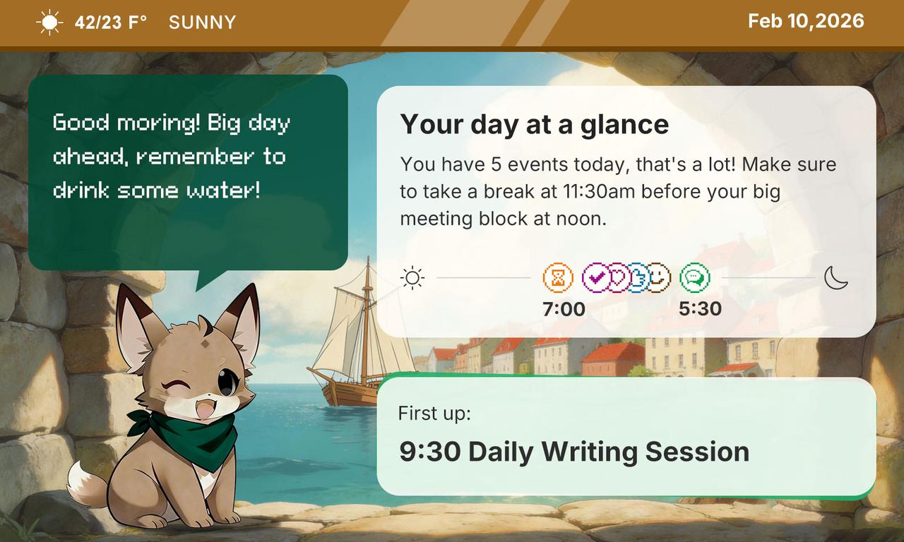
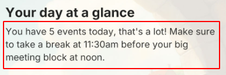
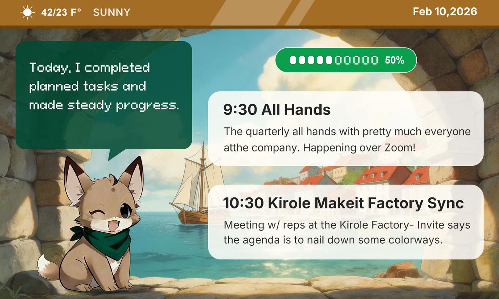
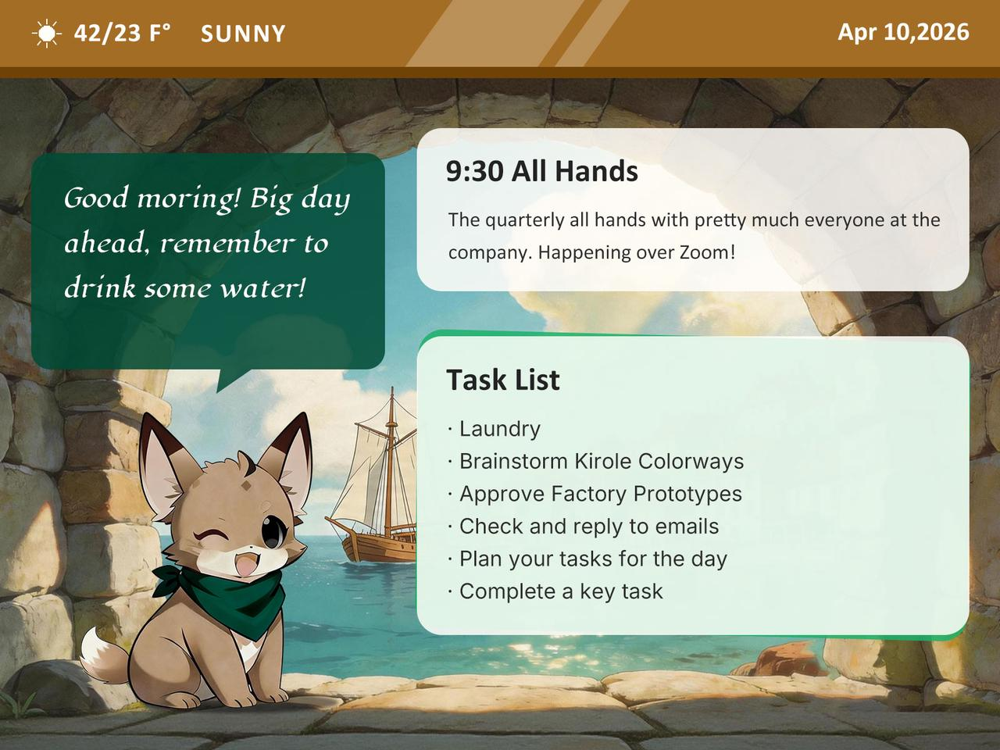
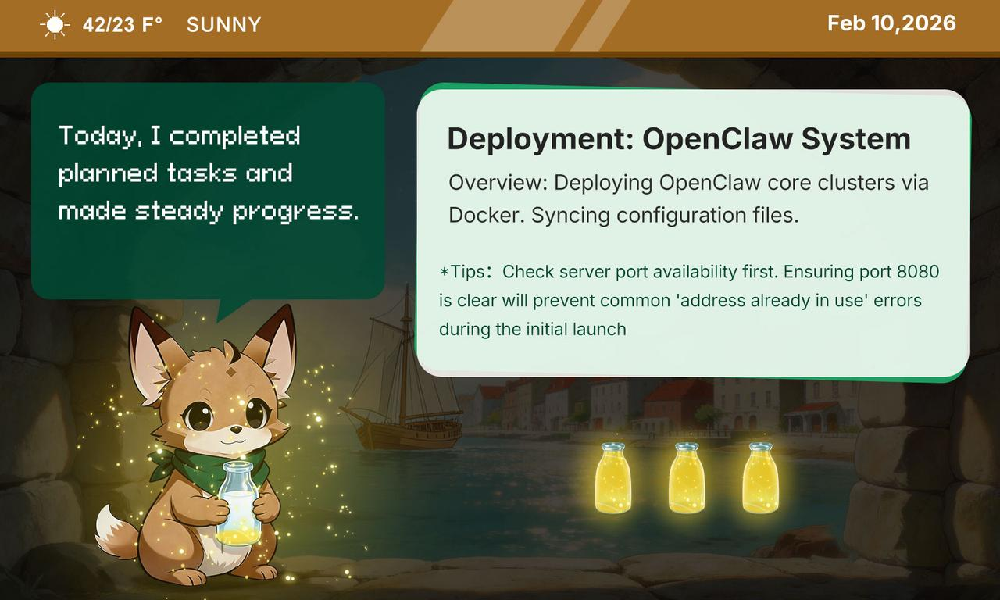
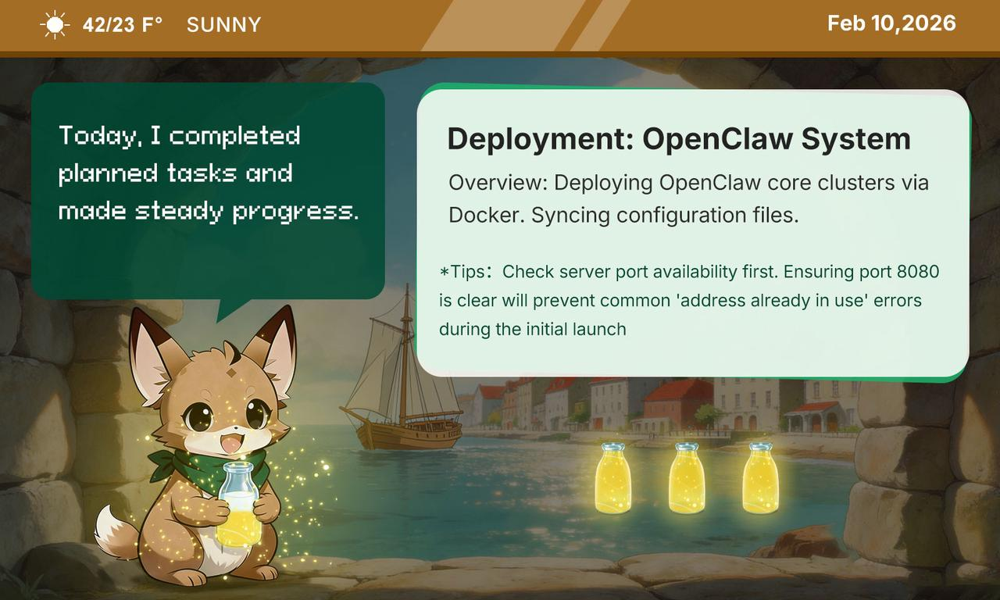
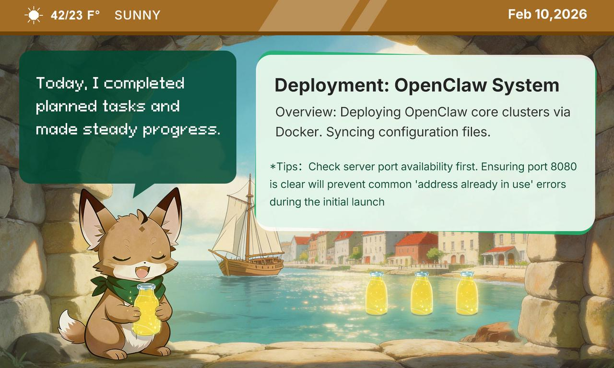
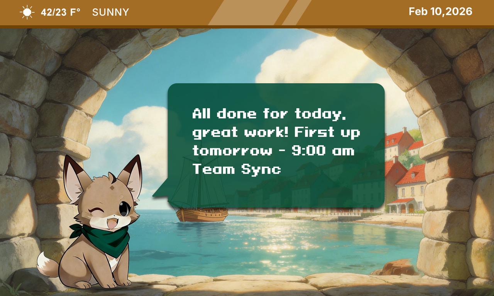

电子墨水屏显示流程与触发逻辑

日程变化页面

页面一. 每日开始日程概览

现触发条件：每日开启显示屏，或者蓝牙第一次联通手机触发开启

调整后新触发条件：两种条件同时触发：1. 日程表全部日程未到达开始时间。2. 当日没有进入任务

内容需求：

1. 一天文字总结，如果繁忙或者有紧凑工作，给休息建议，不然就提醒喝水

* 日程概览图，结合实际日程，图标打标放在时间轴

跳出条件（目前是这个开启10分钟后切换，同时如果已经到了下一个日程的时间或者按下按钮都默认进入下一栏）

页面二. 进行中日程

触发条件：

1. 日程概览达到切换条件

2. 长按或者短按按钮跳出专注任务

情况一，前一个日程结束到下一个日程开始相隔小于10分钟

注：这种情况下显示当日日程完成情况比例

情况二。前一个日程结束到下一个日程开始间隔大于十分钟

页面二跳出条件：在页面期间1. 短按按钮进入专注任务（页面三）或者2. 长按按钮完成当日跳到每日总结（页面四）

页面三：专注页面，分三个阶段逐步切换

0-5分钟页面

5-15分钟页面

大于15分钟页面

瓶子逐步增多

页面三：每日总结

触发条件：在页面二中长按按钮完成当日工作，进入总结页面

跳出条件：如果客户误触，再次长按跳回页面二

总结内容：分3部分

1. 概况点评今日日程+任务专注总结，注：

   1. 日程：如果有死线类型日程一定要提，其他的给AI自己发挥

   2. 同时如果当日专注任务累计时长超过2小时一定要提今天专注多久，其他的给AI自己发挥。

2. 换一行，金句收尾或者明日鼓励：

   1. 日程和任务全部完成：触发金句，庆祝式收尾。金句风格根据AI预设决定

   2. 日程和任务没有全部完成：

      1. 未全部完成 但 日程时间+专注时长大于4小时：建议："今天其实很努力了，只是任务定得有点多，明天可以减少任务数量或降低难度，先从稳定完成开始"，用IP风格表达这个点

      2. 未全部完成 且 日程时间+专注时长小于于4小时：建议："日程比较满的时候，任务可以少排一点，给自己留出专注的空间"

页面四：屏保页面

显示背景，并且给出AI结合每日情况推荐的IP风格金句

触发条件：短按电源键

跳出条件：再次短按电源键，切回原界面

额外需求：

一. 手机切换不同IP,IP形象同步。自定义IP同样把IP同步过去

