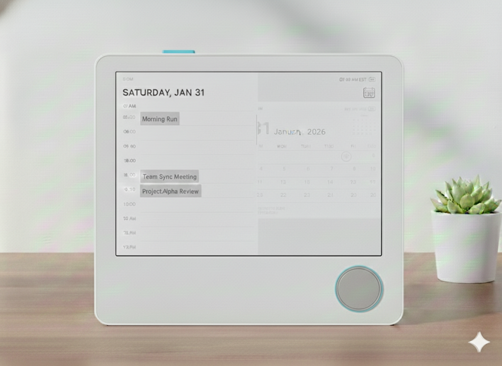
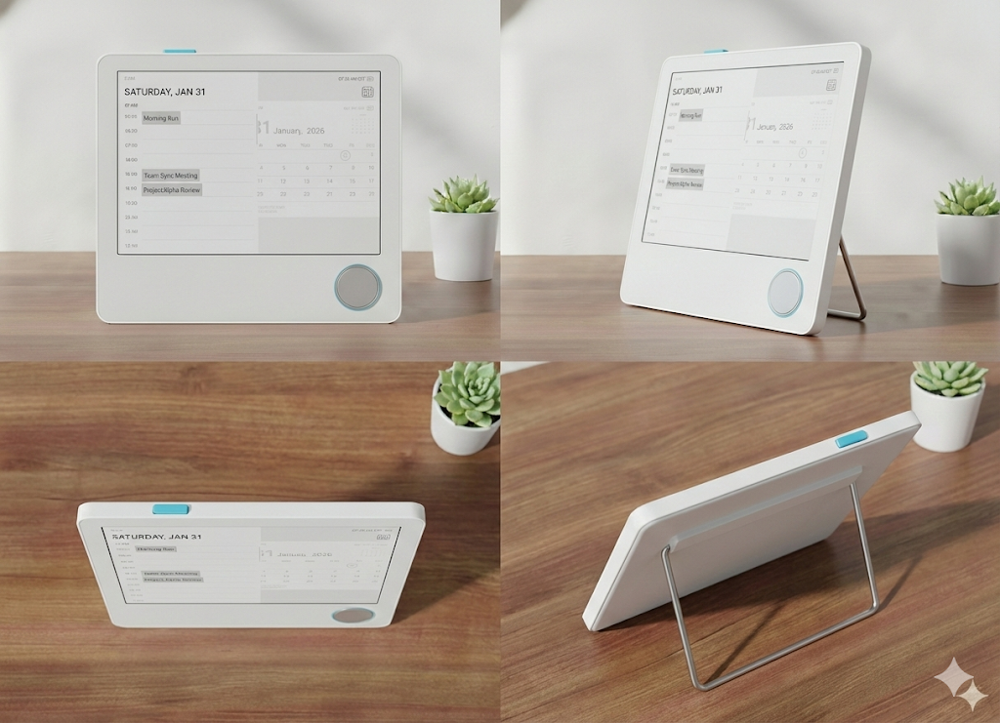
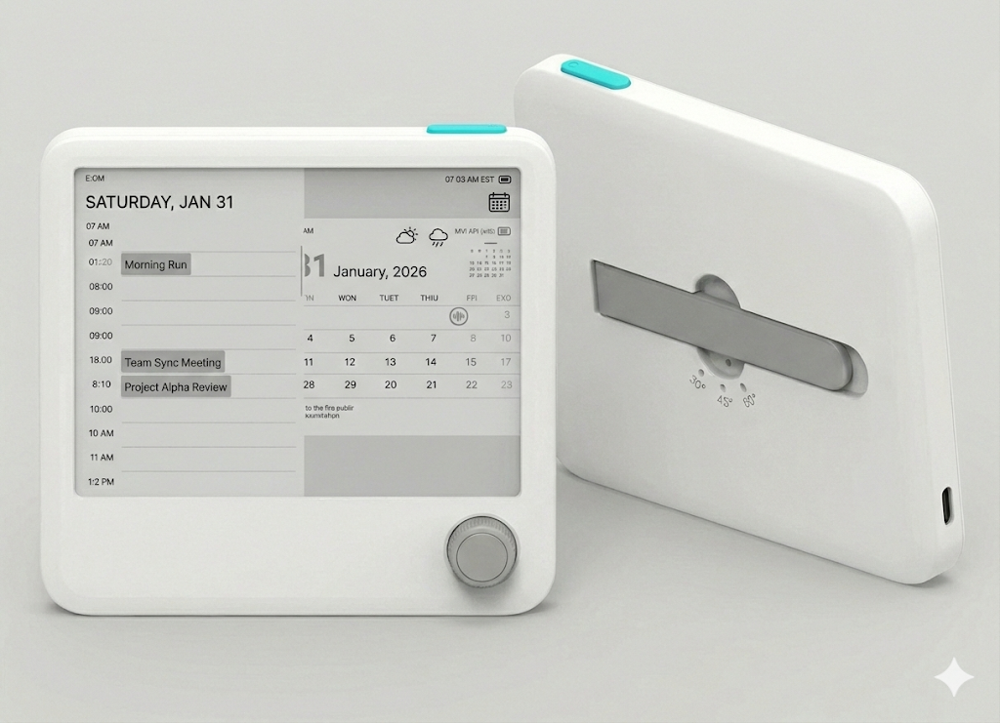
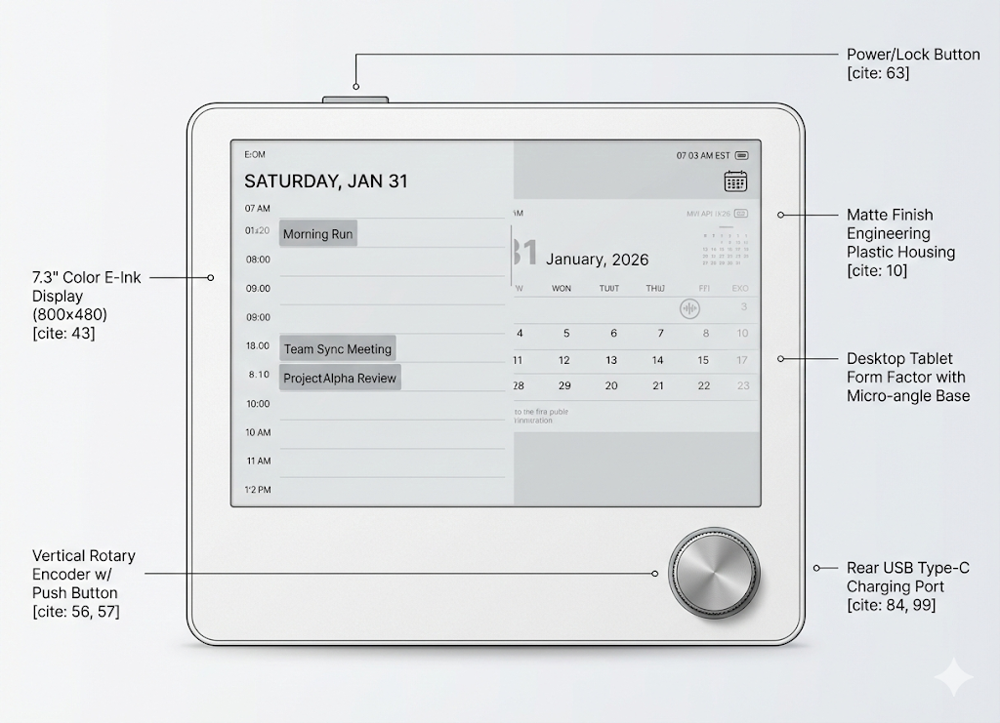

# Kirole 硬件需求文档

**Hardware Requirements Document**

**版本:** v0.2
**更新日期:** 2026-02-12
**状态:** Draft
**前序版本:** v0.1 (2026-01-31)

---

## 目录

1. [文档目的](#1-文档目的)
2. [系统总体架构](#2-系统总体架构)
3. [主控与存储](#3-主控与存储)
4. [显示系统](#4-显示系统)
5. [交互系统](#5-交互系统)
6. [通信系统](#6-通信系统)
7. [电源系统](#7-电源系统)
8. [实时时钟](#8-实时时钟)
9. [非易失性日志](#9-非易失性日志)
10. [可扩展与预留](#10-可扩展与预留)
11. [文档状态](#11-文档状态)

---

## 1. 文档目的

本文档用于定义彩色电子墨水设备（Kirole）的硬件需求范围，为后续原理图设计、PCB Layout、结构设计、BOM 选型及固件开发提供统一依据。

本硬件平台需满足：

- 离线可靠运行
- 低功耗设计
- 清晰、极简但可扩展的人机交互

**产品定位:** Unlock the Flow, Make it Happen.

Kirole 是一款面向深度知识工具用户的专注力伴侣设备，通过 AI 驱动的任务脱水、注意力镜像和智能提醒，配合像素宠物陪伴，帮助用户将复杂意图转化为可执行的微行动。

---

## 2. 系统总体架构

### 2.1 核心设计原则

- 功耗优先，性能平衡，成本其次
- 主控 SoC 长时间处于 Deep Sleep / Light Sleep
- 屏幕刷新、蓝牙通信、交互操作为短时高功耗行为
- 所有关键数据需支持掉电保持

产品的初步示意如下（非最终设计，仅示意）：

### 2.2 核心功能模块

| 模块 | 描述 |
|------|------|
| AI 任务脱水 | AI 将复杂任务分解为 What/When/Why 微行动，降低启动阻力 |
| 注意力镜像 | 反映用户专注模式，量化专注时间、中断次数、峰值时段 |
| 智能提醒 | 基于行为模式的上下文感知提醒（截止日期/连续天数保护/空闲/温和推动） |
| 宠物陪伴 | 像素风格虚拟宠物，5 种形态 × 5 个成长阶段 × 5 种心情 |
| 每日结算 | 统计当日完成情况，含专注指标（总时长/会话数/最长专注/中断数）和积分奖励 |

---

## 3. 主控与存储

### 3.1 主控 SoC

| 参数 | 规格 |
|------|------|
| 选型 | ESP32-S3 模组 |
| 核心 | 双核 Xtensa LX7 |
| BLE | BLE 5.0 |
| 休眠 | 支持 Deep Sleep / 外部 GPIO 唤醒 |
| 射频 | 模组集成射频与天线匹配 |

### 3.2 Flash 存储

| 参数 | 规格 |
|------|------|
| 类型 | 模组自带 SPI NOR Flash |
| 容量 | >= 16MB |

用途：

- 固件程序
- OTA 分区（可选）
- 彩色页面缓存（>= 4 页，4 寸单页 120KB，7.3 寸单页 192KB）
- Event Log（环形缓冲）
- 屏保图片
- 字库
- 宠物像素图资源（5 形态 × 5 阶段 × 6 表情）

### 3.3 PSRAM

| 参数 | 规格 |
|------|------|
| 类型 | 模组集成 PSRAM |
| 容量 | >= 2MB（推荐 4MB） |

用途：

- 屏幕帧缓冲（4 寸: 120,000 bytes，7.3 寸: 192,000 bytes，Spectra 6 4bpp 编码）
- BLE 分包缓存（BLE 包头 9 字节 + payload，需支持多包重组）
- UI 临时数据

---

## 4. 显示系统

### 4.1 屏幕规格

支持两种规格，硬件接口与供电设计需兼容两款屏幕。

#### 4 寸屏幕

| 参数 | 规格 |
|------|------|
| 型号 | SE0400ENV41-CNG-A0 |
| 分辨率 | 400 × 600 像素 |
| 显示技术 | E Ink Spectra 6, 4bpp 全彩色 |
| 色彩 | 6 色（黑、白、黄、红、蓝、绿） |
| 像素编码 | 4bpp，每字节 2 像素，帧缓冲 120,000 bytes |
| 接口 | SPI（4-wire） |

#### 7.3 寸屏幕

| 参数 | 规格 |
|------|------|
| 型号 | SE0730PNW02-CNG-A0 |
| 分辨率 | 800 × 480 像素 |
| 显示技术 | E Ink Spectra 6, 4bpp 全彩色 |
| 色彩 | 6 色（黑、白、黄、红、蓝、绿） |
| 像素编码 | 4bpp，每字节 2 像素，帧缓冲 192,000 bytes |
| 接口 | SPI（4-wire） |

#### Spectra 6 颜色索引（固件 4bpp 编码）

| 颜色 | 索引值 |
|------|--------|
| Black | 0x0 |
| White | 0x1 |
| Yellow | 0x2 |
| Red | 0x3 |
| Blue | 0x5 |
| Green | 0x6 |

### 4.2 显示控制信号

| 参数 | 规格 |
|------|------|
| SPI 信号 | SCLK, MOSI, CS |
| 控制信号 | DC, RST, BUSY |
| SPI 时钟 | <= 20 MHz |

### 4.3 显示功耗特性（7.3 寸 SE0730PNW02）

| 参数 | 典型值 | 最大值 |
|------|--------|--------|
| Deep Sleep 电流 | 1 uA | - |
| Stand-by 电流 | 59.9 uA | - |
| Booster on 涌入 | 84.7 mA | 115.5 mA |
| Driving Peak（典型负载） | 92.0 mA | 142.2 mA |
| Driving Peak（高负载） | 135.4 mA | 180.8 mA |
| 典型功耗（典型负载） | 50.7 mW | - |
| 典型功耗（高负载） | 177.9 mW | - |
| Full Update Time @25C | 12 s | - |
| Full Update Time @0C | 36 s | - |

以上在 VDD=3.0V, 25C 条件。4 寸屏电流参数待实测或更新版规格书校准。

设计要求：供电需满足瞬态电流，避免刷新掉压。

---

## 5. 交互系统

### 5.1 旋转编码器（垂直轴安装）

| 参数 | 规格 |
|------|------|
| 形式 | 旋转编码器 + 按压开关 |
| 安装方式 | 面板垂直安装（轴垂直屏幕），位于屏幕下方 |
| 使用寿命 | >= 100,000 次 |

功能定义：

| 操作 | 功能 |
|------|------|
| 旋转 | 上下选择 / 页面内滚动（反色高亮，纯本地处理） |
| 短按 | 确认选择 / 完成任务（发送 BLE 事件） |
| 长按 (>1s) | 返回 / 跳过任务（由状态机定义） |

### 5.2 电源/功能复合按键

| 参数 | 规格 |
|------|------|
| 数量 | 1 个物理按键 |
| 位置 | 设备侧边（硬件团队决定） |
| 触发力度 | 150-200gf |
| 使用寿命 | >= 100,000 次 |

功能定义：

| 操作 | 功能 |
|------|------|
| 短按 | 唤醒 / 进入屏保 |
| 长按 | 关机确认 / 执行关机（由 UI 状态机区分） |

要求：

- 支持 Deep Sleep 唤醒
- 软件防抖与长按识别

---

## 6. 通信系统

### 6.1 蓝牙

| 参数 | 规格 |
|------|------|
| 类型 | BLE 5.0 |
| 传输距离 | >= 10m（开阔环境） |
| Service UUID | `0000FFE0-0000-1000-8000-00805F9B34FB` |
| 写特征 UUID | `0000FFE1-0000-1000-8000-00805F9B34FB` |
| 通知特征 UUID | `0000FFE2-0000-1000-8000-00805F9B34FB` |

功能：

- 页面数据下发（DayPack、TaskInPage、SmartReminder）
- Event Log 回传（增量同步，基于时间戳）
- 状态同步（任务完成、滚轮选择、提醒确认/关闭）

要求：

- 掉线自动重连
- 大数据分包与 CRC16 校验（CRC16-CCITT-FALSE，poly `0x1021`，init `0xFFFF`）
- 包头格式：type (1B) + messageId (2B BE) + seq (1B) + total (1B) + payloadLen (2B BE) + crc16 (2B BE) = 9 字节

详细协议参考 `BLE-Protocol-Spec.md` (v1.3.0)。

---

## 7. 电源系统

### 7.1 供电方式

- 内置锂电池供电
- USB-C 5V 充电

### 7.2 电源管理

| 参数 | 规格 |
|------|------|
| 充电管理 IC | 支持过充/过放保护 |
| 主电源 | LDO / DCDC（低静态电流 IQ 优先） |
| 峰值电流 | >= 300 mA |
| 瞬态峰值 | >= 500 mA（屏幕刷新 + ESP32 发射叠加） |

### 7.3 电池容量与续航

#### 设计目标

- 目标续航：>= 30 天
- 屏幕刷新仅在"显示内容发生变化"或"用户显式操作"时触发
- 典型自动内容刷新：约 4 次/天

#### BLE 同步策略

| 时段 | 同步频率 | 连接窗口 |
|------|----------|----------|
| 日间 08:00-23:00 | 每 1 小时 | 30 秒 |
| 夜间 23:00-08:00 | 每 4 小时 | 30 秒 |

每日 BLE 同步次数：日间 15 次 + 夜间 2 次 = 17 次/天

#### 能耗估算

| 项目 | 每日消耗 |
|------|----------|
| BLE 同步（17 次 × 30s × 25mA） | 约 3.54 mAh |
| Deep Sleep 底耗（24h × 30uA） | 约 0.72 mAh |
| 屏幕刷新（4 次/天） | 约 0.2 mAh |
| 合计 | 约 4.5 mAh/天 |

#### 推荐电池容量

| 版本 | 推荐容量 | 说明 |
|------|----------|------|
| 4 寸 (400x600) | 500-1200 mAh | 优先考虑结构厚度与重量 |
| 7.3 寸 (800x480) | 1000-2500 mAh | 匹配更大机身空间，预留功能扩展余量 |

实际需考虑电池老化 (>=20% 折减)、低温容量衰减、BLE 重试、PMIC IQ 等，建议保守折减 60-70%。

---

## 8. 实时时钟

| 参数 | 规格 |
|------|------|
| 功能 | 离线定时唤醒、断开 BLE 后保持计时 |
| 首选方案 | ESP32-S3 内部 RTC |
| 可选方案 | 外置高精度 RTC（如 DS3231） |

RTC 用于：

- BLE 断开期间维持时间显示
- 定时唤醒执行 BLE 同步（按同步策略时间窗口）
- Event Log 时间戳记录（epoch seconds）

---

## 9. 非易失性日志（Event Log）

| 参数 | 规格 |
|------|------|
| 存储位置 | SPI Flash |
| 存储方式 | 环形缓冲 |
| 记录格式 | eventType (1B) + timestamp (4B, epoch seconds) + value (2B, big-endian) |

记录内容：

| 事件类型 | 描述 |
|----------|------|
| 按键事件 | 编码器旋转/按压、电源键 |
| 任务完成 | CompleteTask (0x11) |
| 任务跳过 | SkipTask |
| 进入任务 | EnterTaskIn |
| 提醒确认 | ReminderAcknowledged (0x16) |
| 提醒关闭 | ReminderDismissed (0x17) |

要求：

- 掉电不丢失
- BLE 重连后可增量回传（基于 lastEventLogTimestamp）
- App 通过 EventLogRequest 命令请求指定时间戳之后的日志

---

## 10. 可扩展与预留

- 预留 GPIO：调试 / 扩展传感器
- 可选器件：microSD 卡（非必需，仅作为未来扩展）

---

## 11. 文档状态

### 修订历史

| 版本 | 日期 | 变更内容 |
|------|------|----------|
| v0.1 | 2026-01-31 | 初始版本 |
| v0.2 | 2026-02-12 | 转为 Markdown 格式；补充 Spectra 6 4bpp 颜色索引和帧缓冲大小；补充 BLE 包头格式和 CRC16 规格；补充 Event Log 记录格式和事件类型；补充 RTC 用途说明；新增产品定位和核心功能模块描述；与 Hardware-Product-Spec v1.2.0 和 BLE-Protocol-Spec v1.3.0 对齐 |

### 关联文档

| 文档 | 版本 | 描述 |
|------|------|------|
| Hardware-Product-Spec-CN.md | v1.2.0 | 产品功能规格（页面设计、交互流程、宠物系统） |
| BLE-Protocol-Spec.md | v1.3.0 | BLE 通信协议（命令格式、数据结构、事件定义） |

---

如有硬件需求问题或需要澄清，请联系 Kirole 开发团队。
