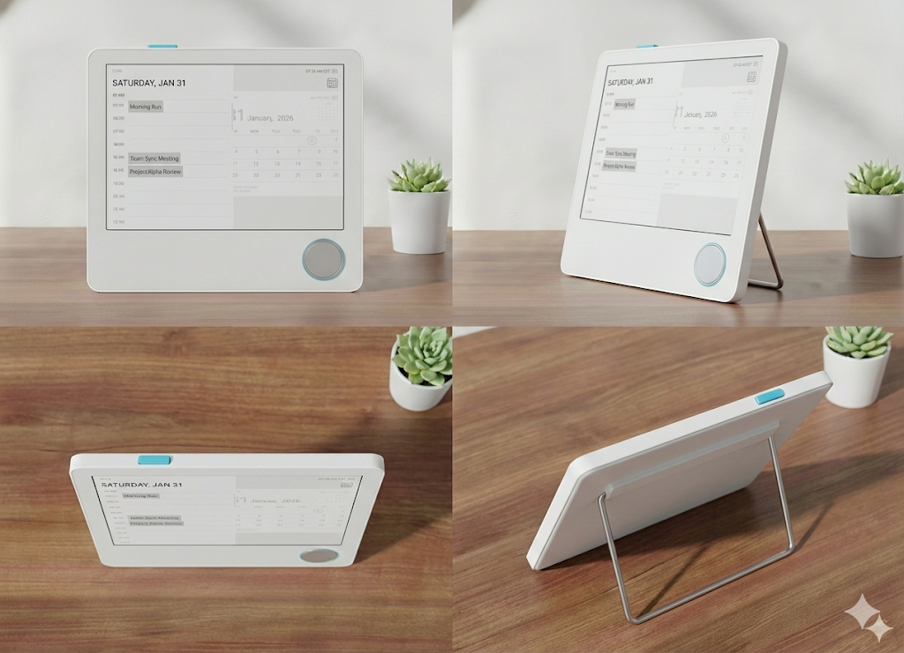
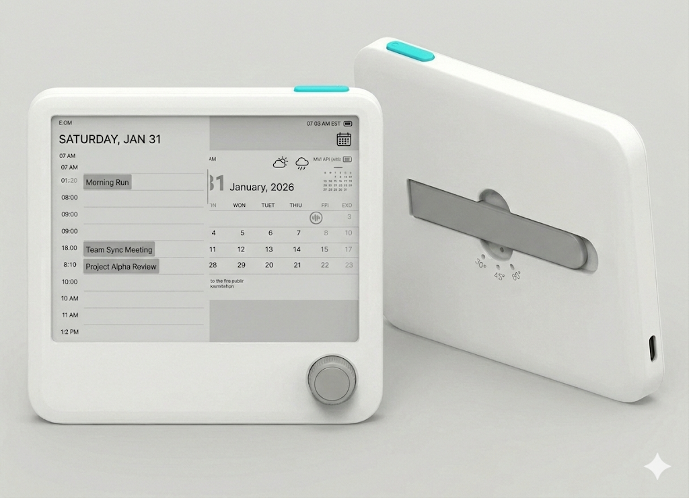
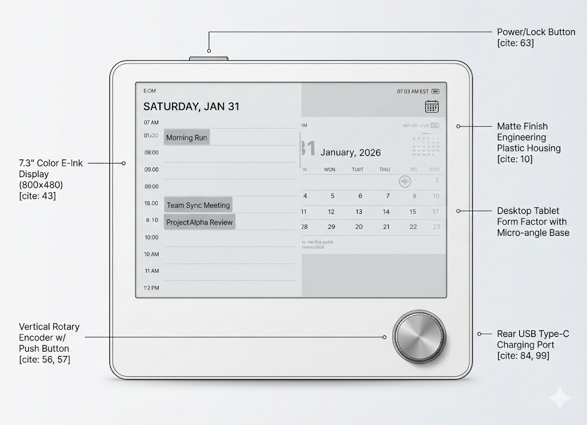

# Kirole 硬件需求文档

**Hardware Requirements Document**

**版本:** v0.8
**更新日期:** 2026-07-27
**状态:** Draft
**前序版本:** v0.7 (2026-07-23)
**v0.8 变更:** 对齐 BLE v2.9.0 任务权威快照 flag-day：任务完成/跳过/刷新使用非零 OperationID/RequestID；新增 `0x1B TaskListSnapshotAck` 业务确认与 `StateEpoch + Revision` 原子替换；设备 pending 不得自行提交最终删除；`0x20` 禁止进入离线 Event Log，升级时清空旧格式环形缓冲。
**v0.7 变更:** 对齐 BLE v2.7 自定义头像事务：`0x15/0x04` 只传 KRI，`0x22` 负责暂存、提交、精确擦除、全部擦除、查询与取消；增加独立头像 LittleFS 分区（默认至少 6 MiB）。

---

## 目录

1. [文档目的](#1-文档目的)
2. [系统总体架构](#2-系统总体架构)
3. [主控与存储](#3-主控与存储)
4. [显示系统](#4-显示系统)
5. [交互系统](#5-交互系统)
6. [通信系统](#6-通信系统)
7. [电源系统](#7-电源系统)
8. [实时时钟](#8-实时时钟)
9. [非易失性日志](#9-非易失性日志)
10. [可扩展与预留](#10-可扩展与预留)
11. [文档状态](#11-文档状态)

---

## 1. 文档目的

本文档用于定义彩色电子墨水设备（Kirole）的硬件需求范围，为后续原理图设计、PCB Layout、结构设计、BOM 选型及固件开发提供统一依据。

本硬件平台需满足：

- 离线可靠运行
- 低功耗设计
- 清晰、极简但可扩展的人机交互

**产品定位:** Unlock the Flow, Make it Happen.

Kirole 是一款面向深度知识工具用户的专注力伴侣设备。iOS App 将任务、日程、智能提醒、专注状态和 Joy / Silas / Nova 三位 IP 伴侣同步到 E-ink 设备，让用户在低干扰屏幕上看到今天要做什么、现在该关注什么。

---

## 2. 系统总体架构

### 2.1 核心设计原则

- 功耗优先，性能平衡，成本其次
- 主控 SoC 长时间处于 Deep Sleep / Light Sleep
- 屏幕刷新、蓝牙通信、交互操作为短时高功耗行为
- 所有关键数据需支持掉电保持

产品的初步示意如下（非最终设计，仅示意）：








### 2.2 核心功能模块

| 模块 | 描述 |
|------|------|
| 伴侣陪伴 | 支持 Joy / Silas / Nova 三位 IP 伴侣的身份和短句显示 |
| 专注反馈 | 反映用户专注模式，量化专注时间、中断次数、能量瓶和场景解锁 |
| 智能提醒 | 基于行为模式的上下文感知提醒（截止日期/连续天数保护/空闲/温和推动） |
| 任务与日程展示 | 显示今日任务、日程、任务详情和完成状态 |
| 每日结算 | 统计当日完成情况，含专注指标（总时长/会话数/最长专注/中断数）和积分奖励 |

---

## 3. 主控与存储

### 3.1 主控 SoC

| 参数 | 规格 |
|------|------|
| 选型 | ESP32-S3 模组 |
| 核心 | 双核 Xtensa LX7 |
| BLE | BLE 5.0 |
| 休眠 | 支持 Deep Sleep / 外部 GPIO 唤醒 |
| 射频 | 模组集成射频与天线匹配 |

### 3.2 Flash 存储

| 参数 | 规格 |
|------|------|
| 类型 | 模组自带 SPI NOR Flash |
| 容量 | >= 32MB（需同时容纳 OTA、页面缓存与默认 6 MiB 头像分区） |

用途：

- 固件程序
- OTA 分区（可选）
- 彩色页面缓存（>= 4 页，4 寸单页 **~207KB（768×552）**，**7.3 寸单页 960KB**）⚠️ 7.3寸实物一直是 1600×1200，单页 960KB（文档此前误写 192KB/800×480）；>=4 页缓存达 3.84MB，请确认 16MB Flash 按此选型
- Event Log（环形缓冲）
- 屏保图片
- 字库
- Joy / Silas / Nova 三位伴侣角色图片资源
- 独立自定义头像 LittleFS 分区（默认至少 6 MiB，用于临时 KRI + 已提交 KRI）

### 3.3 PSRAM

| 参数 | 规格 |
|------|------|
| 类型 | 模组集成 PSRAM |
| 容量 | >= 2MB（推荐 4MB）⚠️ 7.3寸单帧 960,000 bytes，2MB 仅够 1 帧+少量余量，建议复核是否需 4MB+ |

用途：

- 屏幕帧缓冲（4 寸: **211,968 bytes（768×552）**，**7.3 寸: 960,000 bytes**，Spectra 6 4bpp 编码）
- BLE 分片工作缓存（BLE 包头 11 字节 + 小块 payload）。`0x15` 最坏约 2.24 MiB，必须流式写入临时文件，不得在 PSRAM 整帧重组
- UI 临时数据

---

## 4. 显示系统

### 4.1 屏幕规格

支持两种规格，硬件接口与供电设计需兼容两款屏幕。

#### 4 寸屏幕

| 参数 | 规格 |
|------|------|
| 型号 | ⚠️ 待硬件确认（原 SE0400ENV41-CNG-A0 为 400×600，已不符；552×768 面板型号待补） |
| 分辨率 | **552 × 768 像素 @ 237 DPI**（面板原生竖向；**横向使用 768×552**） |
| 显示技术 | E Ink Spectra 6, 4bpp 全彩色 |
| 色彩 | 6 色（黑、白、黄、红、蓝、绿） |
| 像素编码 | 4bpp，每字节 2 像素，帧缓冲 **211,968 bytes**（768×552÷2） |
| 接口 | SPI（4-wire） |

#### 7.3 寸屏幕

| 参数 | 规格 |
|------|------|
| 型号 | ⚠️ 待硬件确认（原 `SE0730PNW02-CNG-A0` 为 800×480 面板，已不符；1600×1200 面板型号待补） |
| 分辨率 | **1600 × 1200 像素（4:3）@ 282 DPI**（面板原生竖向记 1200×1600；横向使用 1600×1200） |
| 显示技术 | E Ink Spectra 6, 4bpp 全彩色 |
| 色彩 | 6 色（黑、白、黄、红、蓝、绿） |
| 像素编码 | 4bpp，每字节 2 像素，帧缓冲 **960,000 bytes** |
| 接口 | SPI（4-wire） |

> **2026-06-26 更新（硬件确认最新尺寸）**：**4 寸 = 552×768 @ 237 DPI（横向 768×552）**、**7.3 寸 = 1600×1200 @ 282 DPI（原生 1200×1600，横向使用）**，两者均 4:3、横向使用，与设计 PSD（第一屏 6.psd 画布 1600×1200）一致。4 寸帧缓冲随之 120,000 → **211,968 bytes**。型号待硬件补正确值；功耗 §4.3、续航 §7.3、布局 §7、伴侣图尺寸（固件 §5.3）原按旧分辨率估算，**需随新分辨率重核**。
> **2026-06-25 更正**：7.3 寸面板分辨率经硬件团队确认为 1600×1200（4:3），非旧版 800×480。

#### Spectra 6 颜色索引（固件 4bpp 编码）

| 颜色 | 索引值 |
|------|--------|
| Black | 0x0 |
| White | 0x1 |
| Yellow | 0x2 |
| Red | 0x3 |
| Blue | 0x5 |
| Green | 0x6 |

### 4.2 显示控制信号

| 参数 | 规格 |
|------|------|
| SPI 信号 | SCLK, MOSI, CS |
| 控制信号 | DC, RST, BUSY |
| SPI 时钟 | <= 20 MHz |

### 4.3 显示功耗特性（旧 7.3 寸 SE0730PNW02 / 800×480 实测）

> ⚠️ 下表为 800×480 SE0730PNW02 面板数据（型号/分辨率均为文档旧值）。实物为 1600×1200（像素数约为 800×480 的 5 倍），刷新涌入电流、Driving Peak、功耗、Full Update Time 应明显高于此表，**需以实际面板规格书/实测校准**。

| 参数 | 典型值 | 最大值 |
|------|--------|--------|
| Deep Sleep 电流 | 1 uA | - |
| Stand-by 电流 | 59.9 uA | - |
| Booster on 涌入 | 84.7 mA | 115.5 mA |
| Driving Peak（典型负载） | 92.0 mA | 142.2 mA |
| Driving Peak（高负载） | 135.4 mA | 180.8 mA |
| 典型功耗（典型负载） | 50.7 mW | - |
| 典型功耗（高负载） | 177.9 mW | - |
| Full Update Time @25C | 12 s | - |
| Full Update Time @0C | 36 s | - |

以上在 VDD=3.0V, 25C 条件。4 寸屏电流参数待实测或更新版规格书校准。

设计要求：供电需满足瞬态电流，避免刷新掉压。

---

## 5. 交互系统

### 5.1 旋转编码器（垂直轴安装）

| 参数 | 规格 |
|------|------|
| 形式 | 旋转编码器 + 按压开关 |
| 安装方式 | 面板垂直安装（轴垂直屏幕），位于屏幕下方 |
| 使用寿命 | >= 100,000 次 |

功能定义：

| 操作 | 功能 |
|------|------|
| 旋转 | 上下选择 / 页面内滚动（反色高亮，纯本地处理） |
| 短按 | 确认选择 / 请求完成任务（发送 v1 BLE 事件；等待 `0x1B` 前只显示 pending） |
| 长按 (>1s) | 返回 / 请求跳过任务（由状态机定义；跳过不删除任务） |

任务动作边界：App 是任务最终状态来源。设备可在按键后立即返回 Overview 并显示 pending，但不能永久提交本地任务减除。只有收到 Action+OperationID 匹配且 `StateEpoch + Revision` 更新的 `TaskListSnapshotAck(0x1B)`，才能原子替换整个 Overview 清单。

### 5.2 电源/功能复合按键

| 参数 | 规格 |
|------|------|
| 数量 | 1 个物理按键 |
| 位置 | 设备侧边（硬件团队决定） |
| 触发力度 | 150-200gf |
| 使用寿命 | >= 100,000 次 |

功能定义：

| 操作 | 功能 |
|------|------|
| 短按 | 唤醒 / 进入屏保 |
| 长按 | 关机确认 / 执行关机（由 UI 状态机区分） |

要求：

- 支持 Deep Sleep 唤醒
- 软件防抖与长按识别

---

## 6. 通信系统

### 6.1 蓝牙

| 参数 | 规格 |
|------|------|
| 类型 | BLE 5.0 |
| 传输距离 | >= 10m（开阔环境） |
| Service UUID | `0000FFE0-0000-1000-8000-00805F9B34FB` |
| 写特征 UUID | `0000FFE1-0000-1000-8000-00805F9B34FB` |
| 通知特征 UUID | `0000FFE2-0000-1000-8000-00805F9B34FB` |

功能：

- 页面数据下发（DayPack、TaskInPage、SmartReminder、TaskListSnapshotAck）
- Event Log 回传（增量同步，基于时间戳）
- 状态同步（任务完成、滚轮选择、提醒确认/关闭）
- 任务动作业务确认（`0x1B` 回显 Action + OperationID，并携带版本化完整 Overview 清单）

要求：

- 掉线自动重连
- 大数据分包与 CRC16 校验（CRC16-CCITT-FALSE，poly `0x1021`，init `0xFFFF`）
- 包头格式：type (1B) + messageId (2B BE) + seq (2B BE) + total (2B BE) + payloadLen (2B BE) + crc16 (2B BE) = 11 字节（v2.5.24 起；分包总数上限 65535）
- GATT withResponse 只作为传输确认；任务完成、跳过、刷新必须以匹配且版本更新的 `0x1B` 作为业务确认

详细协议参考 `BLE通信协议规格文档.md` (v2.9.0)。第一次硬件联调先参考 `BLE初次联调指南.md` (v0.2.0)。

---

## 7. 电源系统

### 7.1 供电方式

- 内置锂电池供电
- USB-C 5V 充电

### 7.2 电源管理

| 参数 | 规格 |
|------|------|
| 充电管理 IC | 支持过充/过放保护 |
| 主电源 | LDO / DCDC（低静态电流 IQ 优先） |
| 峰值电流 | >= 300 mA |
| 瞬态峰值 | >= 500 mA（屏幕刷新 + ESP32 发射叠加） |

### 7.3 电池容量与续航

#### 设计目标

- 目标续航：>= 30 天
- 屏幕刷新仅在"显示内容发生变化"或"用户显式操作"时触发
- 典型自动内容刷新：约 4 次/天

#### BLE 同步策略

| 时段 | 同步频率 | 连接窗口 |
|------|----------|----------|
| 日间 08:00-23:00 | 每 1 小时 | 30 秒 |
| 夜间 23:00-08:00 | 每 4 小时 | 30 秒 |

每日 BLE 同步次数：日间 15 次 + 夜间 2 次 = 17 次/天

#### 能耗估算

| 项目 | 每日消耗 |
|------|----------|
| BLE 同步（17 次 × 30s × 25mA） | 约 3.54 mAh |
| Deep Sleep 底耗（24h × 30uA） | 约 0.72 mAh |
| 屏幕刷新（4 次/天） | 约 0.2 mAh |
| 合计 | 约 4.5 mAh/天 |

#### 推荐电池容量

| 版本 | 推荐容量 | 说明 |
|------|----------|------|
| 4 寸 (768×552) | 500-1200 mAh | 优先考虑结构厚度与重量 |
| 7.3 寸 (1600×1200) | 1000-2500 mAh | 匹配更大机身空间；⚠️ 单帧 960KB、刷新功耗上升，续航需按新分辨率重估 |

实际需考虑电池老化 (>=20% 折减)、低温容量衰减、BLE 重试、PMIC IQ 等，建议保守折减 60-70%。

---

## 8. 实时时钟

| 参数 | 规格 |
|------|------|
| 功能 | 离线定时唤醒、断开 BLE 后保持计时 |
| 首选方案 | ESP32-S3 内部 RTC |
| 可选方案 | 外置高精度 RTC（如 DS3231） |

RTC 用于：

- BLE 断开期间维持时间显示
- 定时唤醒执行 BLE 同步（按同步策略时间窗口）
- Event Log 时间戳记录（epoch seconds）

---

## 9. 非易失性日志（Event Log）

| 参数 | 规格 |
|------|------|
| 存储位置 | SPI Flash |
| 存储方式 | 环形缓冲 |
| 传输格式 | 可变长度：eventType (1B) + payload (N bytes)，详见 BLE通信协议规格文档 Section 5 |
| 批量传输 | eventLogBatch (0x21)：count (1B) + N 条记录 |

事件类型汇总：

| 字节码 | 事件类型 | Payload | 描述 |
|--------|----------|---------|------|
| 0x01-0x06 | 按键事件 | 无 | 编码器旋转/按压 (0x01-0x04)、电源键 (0x05-0x06) |
| 0x10 | EnterTaskIn | Length(1B) + TaskId(NB) + Timestamp(4B) | 进入任务详情页 |
| 0x11 | CompleteTask v1 | SubVersion(01) + OperationID(4B BE, nonzero) + TaskIdLength(1B) + TaskId(NB) + Timestamp(4B BE) | 请求完成任务，可离线补传 |
| 0x12 | SkipTask v1 | SubVersion(01) + OperationID(4B BE, nonzero) + TaskIdLength(1B) + TaskId(NB) + Timestamp(4B BE) | 请求跳过任务，可离线补传 |
| 0x13-0x15 | 交互事件 | Length(1B) + Id(NB) | 选中变更/滚轮选择/查看日程 |
| 0x16 | ReminderAcknowledged | Timestamp(4B) | 用户确认智能提醒 |
| 0x17 | ReminderDismissed | Timestamp(4B) | 提醒超时自动关闭 |
| 0x30-0x31 | 设备状态 | 无 | 设备唤醒/休眠 |
| 0x40 | LowBattery | BatteryLevel(1B) | 低电量通知 |

> `RequestRefresh(0x20)` 自 BLE v2.9.0 起是**实时控制请求**，payload 固定为 `SubVersion(0x01) + RequestID(4B BE, nonzero)`，只走 Notify，禁止写入、排队或重放到 EventLogBatch。App→Device 的 `0x20` 仍是 `EventLogRequest(sinceTimestamp)`，需按方向区分。

App→Device `TaskListSnapshotAck(0x1B)` 是任务动作/刷新业务确认，payload 为：

```text
SubVersion(1) | Action(1) | OperationID(4B BE) | Result(1) |
StateEpoch(4B BE) | Revision(4B BE) | TaskCount(1) | Tasks[]
```

Task 为 `TaskId LP≤36 + Title LP≤30 + IsCompleted(1) + Priority(1)`（LP=`Length(1B)+UTF-8 bytes`）。Result：`00 applied`、`01 alreadyApplied`、`02 taskNotFound`、`03 invalidRequest`、`04 supersededByApp`、`FF internalError`。设备只接受与 pending 的 Action+OperationID 匹配的帧；epoch 改变时只接受新 epoch 的 `revision=1`，同 epoch 只接受严格更大的 revision，整包校验后原子替换清单。该清单与 DayPack.TopTasks 同源：只含当天未完成任务，4 寸最多 3 项、7.3 寸最多 5 项。Complete 移除任务，Skip 保留任务；`supersededByApp` 表示 App 新状态获胜，固件结束 pending、采用快照且不再重试旧动作；`0x02 TaskList` 为 legacy，不参与新状态机。

要求：

- 掉电不丢失
- BLE 重连后可增量回传（基于 lastEventLogTimestamp）
- App 通过 EventLogRequest 命令请求指定时间戳之后的日志
- OperationID 在同一设备 + 动作范围内必须非零；业务确认丢失时原样重发相同 Action/OperationID/TaskId/Timestamp
- v2.9.0 固件升级时清空含旧 `0x11/0x12/0x20` 格式的环形缓冲；新批次只允许严格 v1 Complete/Skip，不允许 RequestRefresh
- App 持久化幂等账本；同 OperationID 同 payload 返回首次缓存的 Result，同 ID 不同 payload 返回 invalidRequest
- App 账本采用 `pending → 状态落盘 → committed` 写前流程；中途退出后，相同请求恢复并幂等补做，不会误报已完成
- App 状态落盘顺序为专注历史 → 清 active 标记 → 任务/宠物状态；任一步失败返回 internalError 并等待原请求重试。当前无固件 apply ACK，App 不按条数静默淘汰 committed OperationID
- EventLogBatch 保持记录线序，不按设备 RTC Timestamp 重排；每条离线任务动作分别用 Action+OperationID 匹配确认
- DayPack 与 `0x1B` 按完整消息串行；固件完整重组、校验后才原子应用。同一 revision 的 App 短重试必须是逐字节相同的 `0x1B`
- 固件把已应用的 StateEpoch、Revision 与完整 Overview 清单一起原子落盘，防止断电后版本和列表分裂
- 详细 payload 格式参见 `BLE通信协议规格文档.md` Section 5

v2.9.0 硬件验收：

- 空 payload `0x20`、旧格式 `0x11/0x12`、零 ID 和尾部多余字节均不改变 App 任务状态。
- 合法 Refresh v1 立即收到 Action+RequestID 匹配的 `0x1B`；无 DayPack 重发也不算失败。
- Complete 的匹配新版本快照移除任务；Skip 的匹配新版本快照保留任务。
- 丢确认后原样重发得到首次缓存的 Result，不重复执行；同 ID 改 payload 得到 invalidRequest。
- App 在设备请求期间执行更新撤销/任务修改，或同任务已有更新专注会话时，返回 supersededByApp；固件采用快照并停止重试旧动作。
- 同 epoch 的旧/相同 revision 不应用；更大 revision 应用；epoch 变化只接受 revision=1。
- 升级后旧环形缓冲已清空，新 EventLogBatch 不含 RequestRefresh。
- 构造 RTC 倒序但 Records 线序为 Complete→Skip 的批次，确认仍按线序结算和回执；不得按 Timestamp 反转。
- 模拟 App 在 pending 后退出、以及 GATT 回调丢失：前者原样重试可恢复动作，后者相同 revision 的 `0x1B` 字节完全一致。

---

## 10. 可扩展与预留

- 预留 GPIO：调试 / 扩展传感器
- 可选器件：microSD 卡（非必需，仅作为未来扩展）

---

## 11. 文档状态

### 修订历史

| 版本 | 日期 | 变更内容 |
|------|------|----------|
| v0.1 | 2026-01-31 | 初始版本 |
| v0.2 | 2026-02-12 | 转为 Markdown 格式；补充 Spectra 6 4bpp 颜色索引和帧缓冲大小；补充 BLE 包头格式和 CRC16 规格；补充 Event Log 记录格式和事件类型；补充 RTC 用途说明；新增产品定位和核心功能模块描述；与固件功能规格文档 v1.2.0 和 BLE通信协议规格文档 v1.3.0 对齐 |
| v0.3 | 2026-02-12 | Event Log 格式修正为可变长度 payload（与代码和 BLE通信协议规格文档对齐）；补充完整事件类型表含字节码和 payload 格式 |
| v0.4 | 2026-05-07 | 对齐当前 App 协议和产品 IP：硬件侧支持 Joy / Silas / Nova，删除旧多形态资源要求 |
| v0.5 | 2026-06-25 | **7.3 寸面板分辨率更正为 1600×1200（4:3）**（原误为 800×480）：同步更新帧缓冲 192,000→960,000、Flash 单页缓存 192KB→960KB、PSRAM 余量提示、续航重估提示；面板型号待补、功耗按新分辨率待重测。**4 寸（400×600）暂未确定，保持不动。** |
| v0.7 | 2026-07-23 | 对齐 BLE v2.7 自定义头像事务与独立 LittleFS 头像分区 |
| v0.8 | 2026-07-27 | 对齐 BLE v2.9.0 任务权威快照：严格 OperationID/RequestID、0x1B 业务确认、版本化原子替换、pending 边界和旧离线日志迁移 |

### 关联文档

| 文档 | 版本 | 描述 |
|------|------|------|
| 固件功能规格文档.md | v1.8.0 | 产品功能规格与任务快照状态机 |
| BLE初次联调指南.md | v0.2.0 | 第一次硬件联调与 v2.9 请求/确认验收 |
| BLE通信协议规格文档.md | v2.9.0 | BLE 通信协议（严格任务动作、幂等 OperationID、权威快照） |

---

如有硬件需求问题或需要澄清，请联系 Kirole 开发团队。
